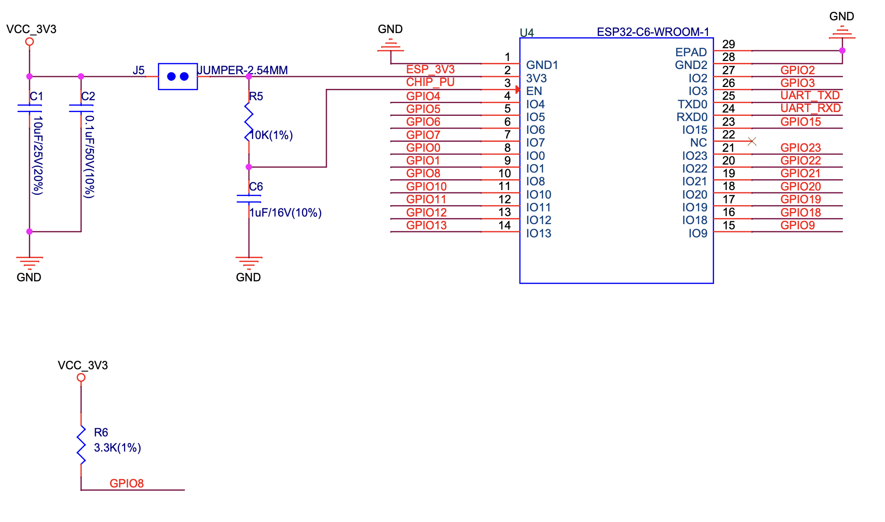

# Sistem Integrat de Monitorizare a Nivelului de Lichid dintr-o Perfuzie și a Semnelor Vitale ale Pacientului

**Autor:** Madlena Blajin  
**Grupa:** 332CB  
**Platformă:** ESP32-C6-DevKitC-1-N8  

---

## Descriere proiect

Proiectul propune realizarea unui sistem embedded pentru monitorizarea în timp real a nivelului de lichid dintr-o perfuzie și a parametrilor vitali ai pacientului. Sistemul detectează automat momentul în care perfuzia ajunge la un nivel critic, monitorizează semnalul ECG și pulsul pacientului, generează alerte sonore și transmite datele wireless către un dashboard web pe PC.

---

## Componente folosite

| Componentă | Model | Rol |
|---|---|---|
| Microcontroller | ESP32-C6-DevKitC-1-N8 | Unitate centrală |
| Senzor nivel lichid | DFRobot SEN0204 (XKC-Y25-T12V) | Detectare nivel perfuzie |
| Senzor pulsoximetrie | DFRobot SEN0344 (MAX30102) | Puls și SpO2 |
| Modul ECG | AD8232 + electrozi | Semnal ECG |
| Display | OLED 128x64 SPI | Afișare locală |
| Buzzer | KY-006 pasiv | Alertă acustică |
| Modul încărcare | TP4056 cu protecție | Încărcare LiPo |
| Convertor tensiune | MT3608 Boost DC-DC | 3.7V → 5V |
| Acumulator | LiPo 3.7V 550mAh (Akyga LP503040) | Alimentare portabilă |
| Rezistențe | 220Ω, 10kΩ | Circuite auxiliare |
| Fire conexiune | Dupont tată-tată, tată-mamă 20cm | Conexiuni breadboard |
| Placă prototipare | Breadboard 830 puncte | Asamblare circuit |

---

## Pinout ESP32-C6-DevKitC-1-N8

### Pini folosiți în proiect

| GPIO | Componentă | Semnal | Protocol |
|---|---|---|---|
| GPIO0 | AD8232 | OUTPUT (ECG) | ADC |
| GPIO1 | AD8232 | LO+ | Digital IN |
| GPIO2 | AD8232 | LO- | Digital IN |
| GPIO3 | OLED | RESET | SPI |
| GPIO4 | OLED | DC | SPI |
| GPIO5 | OLED | CS | SPI |
| GPIO6 | OLED | CLK | SPI |
| GPIO7 | OLED | MOSI | SPI |
| GPIO10 | Buzzer KY-006 | PWM | PWM |
| GPIO11 | SEN0204 | OUT | Digital IN |
| GPIO20 | MAX30102 | SDA | I2C |
| GPIO21 | MAX30102 | SCL | I2C |

### Alimentare

| Pin ESP32 | Conectat la |
|---|---|
| 3.3V | OLED VCC, MAX30102 VCC, AD8232 VCC |
| 5V (VIN) | SEN0204 VCC (prin MT3608) |
| GND | Toate componentele |

---

## Schema de conexiuni



## Software

### Mediu de dezvoltare
- **PlatformIO** cu VS Code
- **Framework:** Arduino

### platformio.ini
```ini
[env:esp32-c6-devkitc-1]
platform = https://github.com/pioarduino/platform-espressif32/releases/download/54.03.20/platform-espressif32.zip
board = esp32-c6-devkitc-1
framework = arduino

monitor_speed = 115200
upload_speed = 115200

build_flags = 
    -DARDUINO_USB_MODE=1
    -DARDUINO_USB_CDC_ON_BOOT=1

lib_deps =
    adafruit/Adafruit BusIO
    adafruit/Adafruit GFX Library
    adafruit/Adafruit SSD1306
    sparkfun/SparkFun MAX3010x Sensor Library
    mathieucarbou/ESPAsyncWebServer
    mathieucarbou/AsyncTCP
```

### Librării folosite
- **Adafruit SSD1306** — driver OLED
- **Adafruit GFX** — grafică OLED
- **SparkFun MAX3010x** — citire MAX30102
- **ESPAsyncWebServer** — web server async
- **AsyncTCP** — TCP asincron pentru WebSocket

### Structura codului
```
src/
  main.cpp       <- logica principala
  dashboard.h    <- HTML/CSS/JS dashboard web
```

---

## Funcționalități implementate

### Periferice utilizate
- **ADC** — citire semnal analogic ECG de la AD8232
- **Timer + ISR** — achiziție periodică date senzori
- **PWM** — control buzzer pasiv cu frecvență variabilă
- **I2C** — comunicație cu MAX30102
- **SPI** — comunicație cu OLED display
- **UART** — debug serial și Teleplot
- **WiFi** — transmisie date către dashboard web

### Laboratoare acoperite
- **Lab 1 (UART)** — debug serial și Teleplot
- **Lab 2 (Întreruperi)** — ISR pentru achiziție date
- **Lab 3 (Timere & PWM)** — buzzer pasiv
- **Lab 4 (ADC)** — semnal ECG analogic
- **Lab 6 (I2C)** — MAX30102

---

## Web Dashboard

După upload, ESP32 se conectează la WiFi și afișează IP-ul pe OLED.
Deschide IP-ul în browser (aceeași rețea WiFi) pentru a accesa dashboard-ul.

Dashboard-ul afișează:
- Status nivel perfuzie (OK / LOW)
- Valoare ECG în timp real
- Grafic ECG live prin WebSocket
- Alertă vizuală roșie când perfuzia e critică

---

## Cum uploadezi codul

1. Conectează ESP32-C6 prin cablu USB-C cu date
2. Deschide proiectul în VS Code cu PlatformIO
3. Apasă Upload (săgeata →)
4. Deschide Serial Monitor la 115200 baud
5. Apasă RESET pe ESP32

---

## Probleme cunoscute și soluții

| Problemă | Cauză | Soluție |
|---|---|---|
| Serial Monitor gol | ESP32-C6 USB nativ | Adaugă build_flags în platformio.ini |
| OLED nu funcționează | Adresă greșită sau pini SPI inversați | Verifică conexiunile și tipul SPI/I2C |
| SEN0204 citește mereu 0 | Divizor de tensiune taie semnalul | Conectează direct la GPIO |
| Buzzer nu sună | tone() incompatibil ESP32-C6 | Folosește ledcAttach() / ledcWrite() |
| MAX30102 not found | Pini header nelipiți | Lipește pinii cu lipitoare |

---

## Bibliografie

### Hardware
- ESP32-C6-DevKitC-1 Official User Guide: https://docs.espressif.com/projects/esp-dev-kits/en/latest/esp32c6/esp32-c6-devkitc-1/user_guide.html
- DFRobot SEN0204: https://www.dfrobot.com/product-2434.html
- DFRobot SEN0344 MAX30102: https://www.dfrobot.com/product-1993.html
- AD8232 ECG Datasheet: https://www.analog.com/en/products/ad8232.html

### Software
- PlatformIO Documentation: https://docs.platformio.org
- Adafruit SSD1306 Library: https://github.com/adafruit/Adafruit_SSD1306
- SparkFun MAX3010x Library: https://github.com/sparkfun/SparkFun_MAX3010x_Sensor_Library
- ESPAsyncWebServer: https://github.com/mathieucarbou/ESPAsyncWebServer
